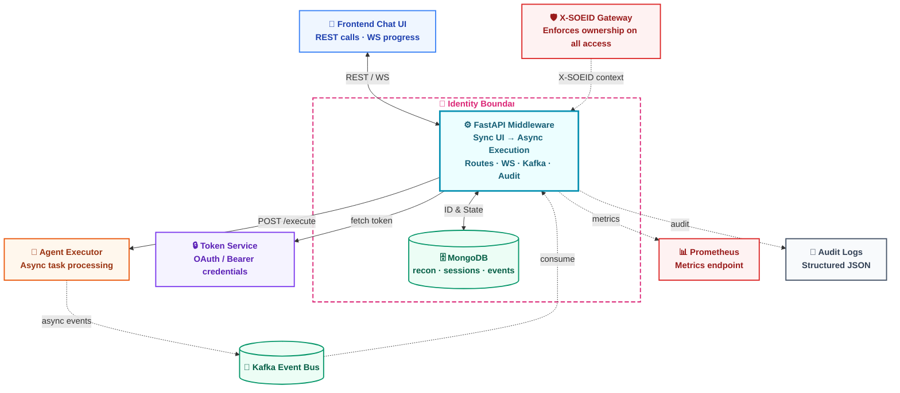
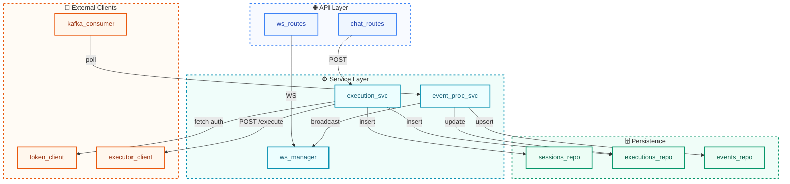
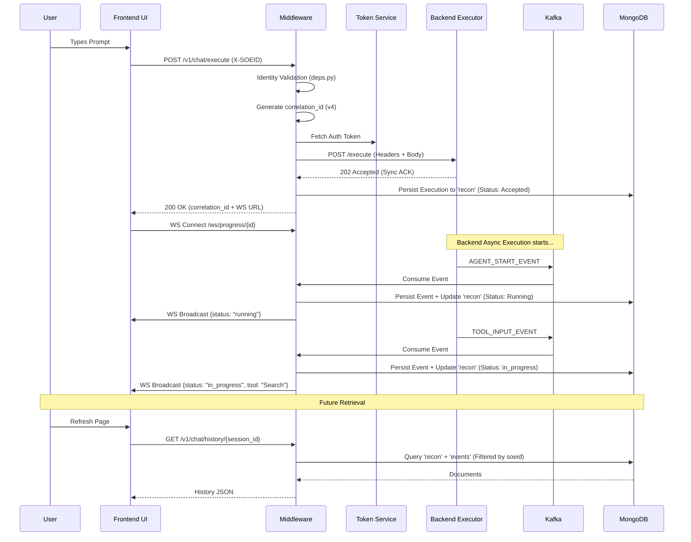
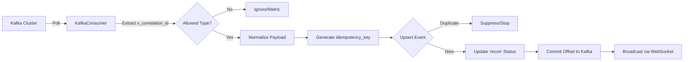
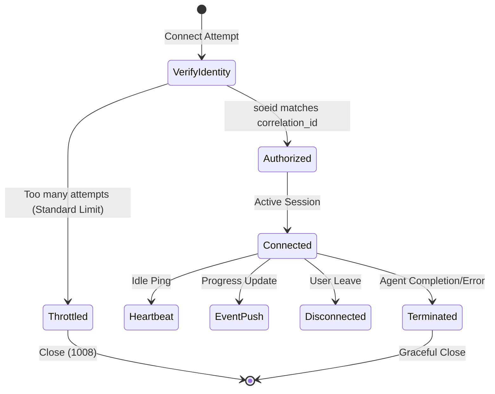
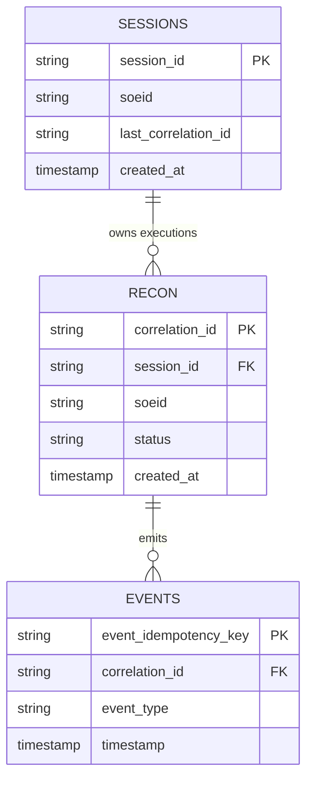
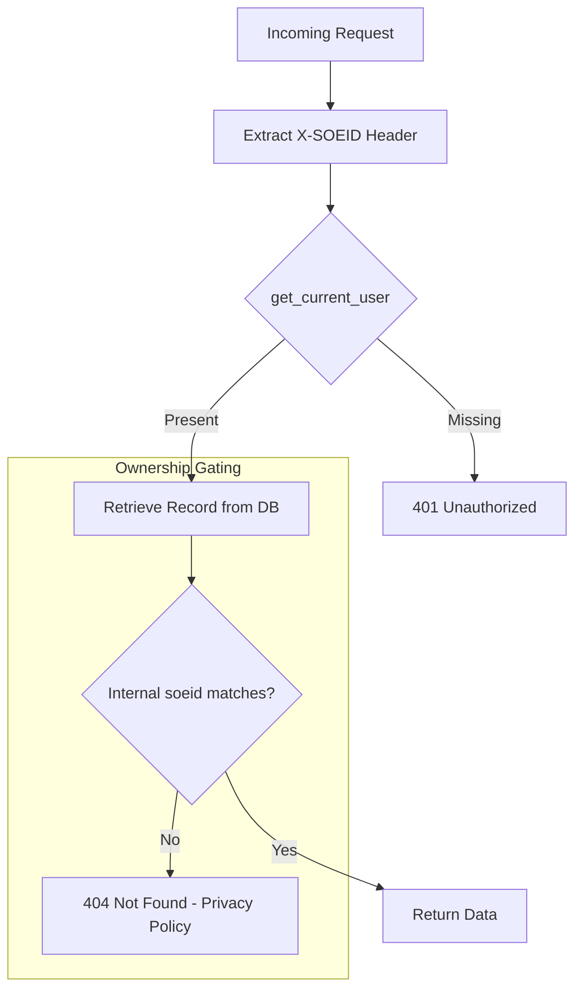
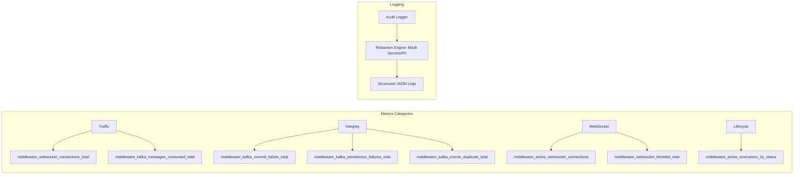

# Technical Walkthrough: Agentic Middleware System

This document provides a deep-dive architectural and operational walkthrough of the Agentic Middleware. It is designed for architects, backend/frontend engineers, and DevOps teams to understand the system's runtime dynamics, security boundaries, and data integrity guarantees.

---

## Slide 1: Executive Architecture (Full Ecosystem)

The middleware acts as a high-fidelity broker between the ephemeral frontend UI and the asynchronous backend Agent Executor.

> [!TIP]
> **Key Anchors**:
> - **FastAPI**: Provides high-performance async concurrency for IO-bound Kafka/DB operations.
> - **Kafka**: Decouples long-running Agent execution from user requesting thread.
> - **MongoDB**: Serves as the immutable "System of Record" for all historical and active runs.

---

## Slide 2: Detailed Component Map

Internal modular structure of the `app/` directory, illustrating separation of concerns between delivery, logic, and persistence.

---

## Slide 3: Core Design Decisions

Strategic callouts explaining *why* the architecture is structured this way.

| Decision | Rationale |
| :--- | :--- |
| **Session vs Correlation ID** | `session_id` persists through an entire user conversation. `correlation_id` (UUID v4) provides a deterministic trace for a *single* run within that session. |
| **The `recon` Collection** | Maps Execution/Run records to a centralized "Reconciliation" collection for operational audits and history tracking. |
| **Mongo as Source of Truth** | WebSockets are for "Volatile Delivery" (transient). Mongo allows a client to disconnect/reconnect and immediately "hydrate" state from the historical event log. |
| **Privacy: 404 vs 403** | Unauthorized access to another user's `session` or `correlation_id` returns **404 Not Found** to prevent malicious ID enumeration (Silent Rejection). |

---

## Slide 4: End-to-End Sequence Diagram

The complete lifecycle from a user's initial prompt to real-time status updates and historical retrieval.

---

## Slide 5: Kafka Processing Pipeline

A robust, at-least-once processing pipeline with duplicate suppression and atomic persistence.

> [!IMPORTANT]
> **Commit-after-Persistence**: Offsets are only committed to Kafka *after* successful MongoDB persistence. If DB is down, events are redelivered, and idempotency keys prevent duplicates.

---

## Slide 6: WebSocket Lifecycle

Gated, throttled, and resilient real-time delivery.

> [!WARNING]
> **Horizontal Scaling Notice**: The current `WebSocketManager` is in-memory and limited to **single-instance** deployments. Migration to shared Pub/Sub (e.g., Redis) is required for multi-node middleware clusters.

---

## Slide 7: MongoDB Data Model

A split-view of logical entity connections and the optimized query paths derived from compound indexes.

### Layer 1: Logical Relationships

### Layer 2: Query & Index Patterns

| Target Collection | Query Path (Filters) | Supporting Index | Rationale |
| :--- | :--- | :--- | :--- |
| **recon** | `{soeid, correlation_id}` | `(soeid, correlation_id)` | Gated lookup; index prefix matches auth check. |
| **recon** | `{session_id}` | `session_id` | Historical listing within a conversation. |
| **sessions** | `{soeid, session_id}` | `(soeid, session_id)` | Identity-gated session retrieval. |
| **events** | `{correlation_id, timestamp}` | `(correlation_id, timestamp)` | Sequential event log replay for the UI. |
| **events** | `{event_idempotency_key}` | `event_idempotency_key` (Unique) | Kafka duplicate prevention. |

---

## Slide 8: Security & Ownership Flow

Detailed mechanics of the `soeid` identity adapter and the 404 privacy policy.

---

## Slide 9: Observability Stack

Metrics and Logging categorized by operational impact.

---

## Slide 10: Developer Code Map

Navigational guide for engineers maintaining the repository.

| Folder / File | Responsibility | Core Concept |
| :--- | :--- | :--- |
| `app/main.py` | App entry, lifespan config, rate limit init. | Bootstrap |
| `app/api/` | Delivery layer: Chat routes, WebSockets, Auth dependencies. | Deliver |
| `app/core/` | Cross-cutting concerns: Config, Throttling, Exceptions. | Config |
| `app/services/` | Business logic: Execution orchestration, Event processing. | Orchestrate |
| `app/clients/` | External IO: Token API, Backend API, Kafka Polling. | Connect |
| `app/db/repositories/` | Physical storage mapping (recon, sessions, events). | Persist |
| `app/utils/` | Shared utilities: Audit logging, Metrics, Retry, ID generation. | Utility |
| `app/models/` | Type safety: API Schemas, DB Docs, Kafka Event shapes. | Schema |

---

## Slide 11: Feature-to-Code Traceability

Mapping high-level system guarantees to specific technical implementations.

| Feature | Primary Files | Supporting Files | Runtime Behavior |
| :--- | :--- | :--- | :--- |
| **Execute Flow** | `chat_execution_service.py` | `chat_routes.py`, `backend_executor_client.py` | Accepts POST, generates IDs, fetches tokens, calls backend, and persists initial record. |
| **At-Least-Once Kafka** | `kafka_consumer.py` | `event_processing_service.py` | Polls partitions; commits offset *only after* repository commit is confirmed. |
| **Idempotency** | `events_repository.py` | `mongo.py`, `kafka_events.py` | Uses `event_idempotency_key` with Mongo Unique Index to drop duplicate messages. |
| **Ownership Gating** | `deps.py` | `chat_routes.py`, `executions_repository.py` | Extracts `X-SOEID`; every repo query includes mandatory `soeid` filter predicate. |
| **Privacy Policy** | `chat_routes.py` | `status_service.py` | Intercepts ownership mismatches and returns 404 to hide resource existence. |
| **Live Updates** | `websocket_manager.py` | `websocket_routes.py`, `event_processing_service.py` | Manages active socket maps; pushes normalized events to correct user channel. |
| **Audit Hygiene** | `audit_logger.py` | `chat_execution_service.py` | Masks secrets and context fields before sending lifecycle data to logs. |
| **Throttling** | `throttler.py` | `websocket_routes.py`, `lifespan.py` | Tracks connection frequency per IP/User; prunes stale map entries via background loop. |
